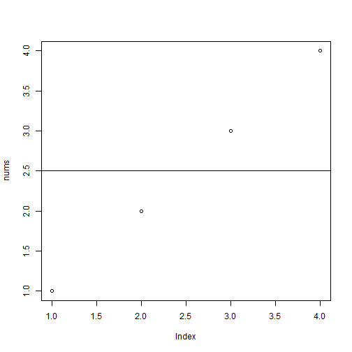
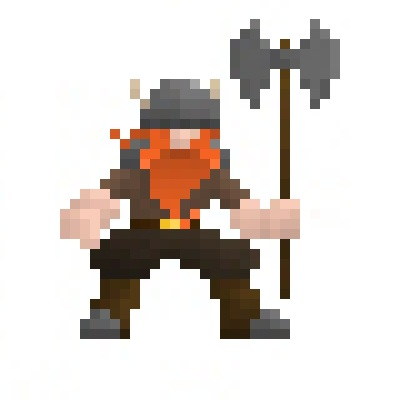

Hello. Let's talk about lists of numbers.

--- &radio

## Do you ever need to average lists of numbers?

1. _Yes!_
2. No

*** .hint
HINT: Everyone needs to average lists of numbers. All the time.

*** .explanation
People are always tossing around lists of numbers. What else would we do with them?

---

# Here's the code


```r
text <- "1, 2, 3, 4";
nums <- sapply(strsplit(text, "\\s*,\\s*"), as.numeric);
avg <- mean(nums);
avg;
```

```
## [1] 2.5
```

---  

# Here are the results


```r
plot(nums);
abline(h = avg);
```

 

---

Does that sound like a great tool to have?

Well, enjoy: https://courseradude.shinyapps.io/project/

Github: https://github.com/381265947/DataProductsCourseProject

---

# Goodbye!


